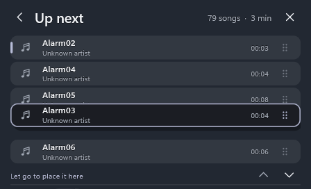
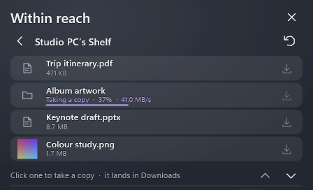

# Arnav Island 0.17 — Up next, your other PC's Shelf, and an island you can hear

A native Windows 11 island with physical spring motion, real system information and no cloud.

[Download the Windows x64 preview](https://github.com/Arnav-Dugad/arnav-island/releases/tag/v0.18.0-preview.1)

- **Up next**: the island's queue, dragged into order, with the next song's cover peeking out from behind the one playing.
- **Crossfades** between songs, and music that fades out as it moves to your other PC and rises in there, cover and all.
- **Your other PC's Shelf**: look into it from Nearby and take a copy of anything on it.
- **Big transfers** show a ring that widens with their speed, with the time left.
- **Two alerts side by side** when you point at them.
- **Screen readers** can read and use everything on the island, and hear its alerts.
- **Weather anywhere**: choose the town in Settings, with its region, from Manipal to Jubail.
- Carried forward: drop to share, music from the island, two alerts at once, drag to skip, the clipboard across restarts, the drop pill, weather with an animated sky, the Controls page, compact media controls, word-timed lyrics, the glass material, file search, system switches, capture tools, Shelf actions, per-app volume, workspaces and more.

No account, subscription, browser engine, driver or administrator access is required. Extract the ZIP and run ArnavIsland.exe. Only a few features go online, and all are off until you turn them on: synced lyrics, currency conversion, weather and site icons. Sharing and handing music over talk only to your own PCs on your network; the music library reads your Music folder on this PC only.

[Release notes](docs/RELEASE_NOTES.md) · [Quick start](docs/QUICK_START.md) · [Report](docs/REPORT.md) · [Feature limits](docs/FEATURE_MATRIX.md) · [Delivery phases](docs/DELIVERY_PHASES.md) · [Design system](docs/DESIGN_SYSTEM.md) · [Performance](docs/PERFORMANCE_RESULTS.md) · [Privacy](docs/PRIVACY.md)

## Build

MinGW-w64 GCC 16 and CMake: `scripts/build.ps1 -Test` builds the app and runs the unit suites; `scripts/package.ps1` makes the release ZIP. Backend: Win32, DirectComposition, Direct2D/DirectWrite, Windows.UI.Composition for glass, Windows.Media.Ocr for text recognition, WIC for images, the Windows Search index (OLE DB) for files, Windows.Devices.Radios for Bluetooth and Wi-Fi, PDH performance counters for the GPU, UI Automation for screen readers, WinHTTP for the optional lyrics, exchange rates, weather and site icons, Winsock with Windows CNG (ECDH P-256, AES-GCM) and DPAPI for sharing between your PCs, and Media Foundation with Windows media transport controls for the island's own player. Unavailable values are shown as unavailable, never invented.

