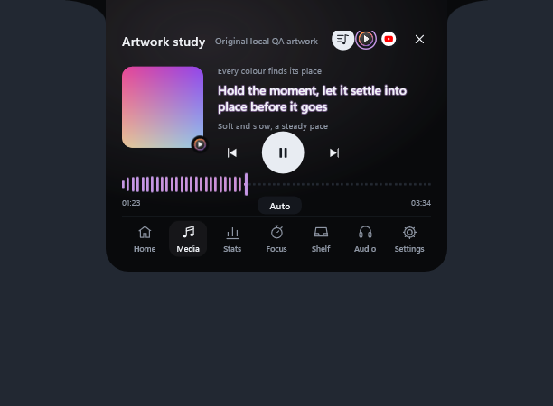
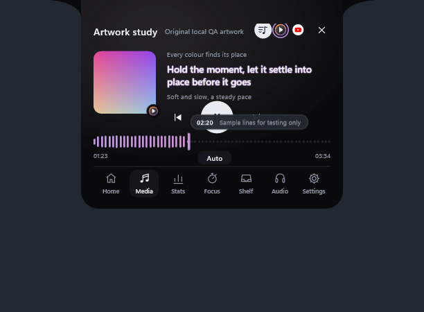
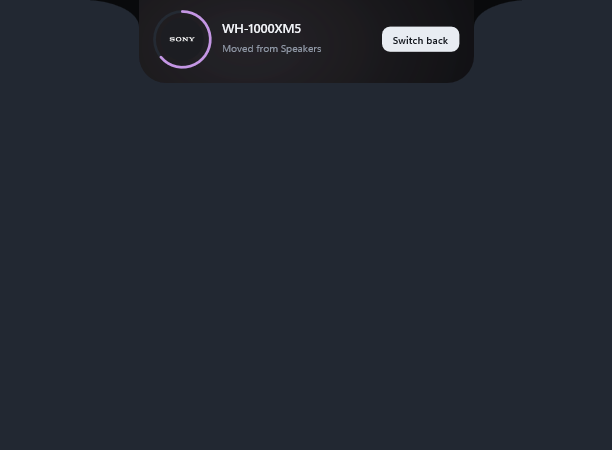

# Arnav Island 0.11 — Now Playing Pro

A native Windows 11 island with physical spring motion, real system information and no cloud.

[Download the Windows x64 preview](https://github.com/Arnav-Dugad/arnav-island/releases/tag/v0.11.0-preview.1)

- **Synced lyrics** (opt-in): the line being sung in the compact island, on the Live card and on the Media page, from LRCLIB. Only the song title and artist are sent, and lyrics are saved on your PC.
- **Colours from the artwork**: the timeline and waveform run from the cover's main colour to its second, the glow takes its overall tone, and the light island finally follows the artwork too.
- **Smarter seeking**: a time bubble (with the lyric at that point), detents at 10 s marks and lyric lines, double-click the artwork to skip 10 s, arrow keys on the timeline.
- **Headphone card**: when Windows moves your sound to headphones, the island says so and offers *Switch back*.
- **Audio controls**: scroll over the playing app's logo to change just that app's volume; mute your microphone from the Audio page or by typing "mute mic".
- Carried forward: Frosted and Clear glass, the Animation Lab in Settings, the waveform timeline, command bar, workspaces, clipboard history, privacy dots, edge reveal, Bluetooth and battery cards, per-app mixer, focus timer, file shelf and 180 brand marks.

No account, subscription, browser engine, driver or administrator access is required. Extract the ZIP and run ArnavIsland.exe. The only feature that goes online is synced lyrics, and it is off until you turn it on.

[Release notes](docs/RELEASE_NOTES.md) · [Quick start](docs/QUICK_START.md) · [Report](docs/REPORT.md) · [Feature limits](docs/FEATURE_MATRIX.md) · [Delivery phases](docs/DELIVERY_PHASES.md) · [Design system](docs/DESIGN_SYSTEM.md) · [Performance](docs/PERFORMANCE_RESULTS.md) · [Privacy](docs/PRIVACY.md)

## Build

MinGW-w64 GCC 16 and CMake: `scripts/build.ps1 -Test` builds the app and runs the unit suites; `scripts/package.ps1` makes the release ZIP. Backend: Win32, DirectComposition, Direct2D/DirectWrite, Windows.UI.Composition for the glass backdrop, and WinHTTP for the optional lyrics lookup. Unavailable values are shown as unavailable, never invented.

