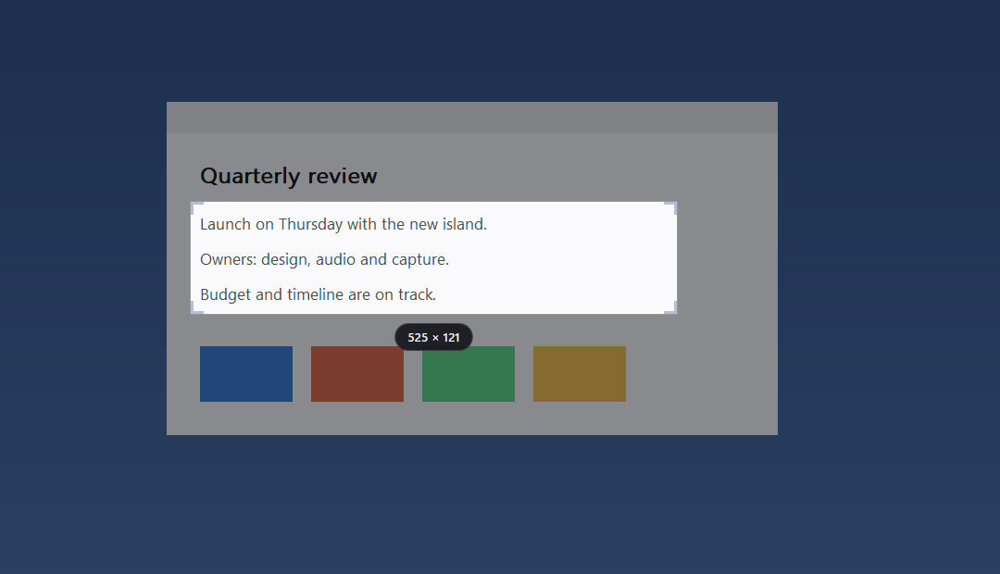
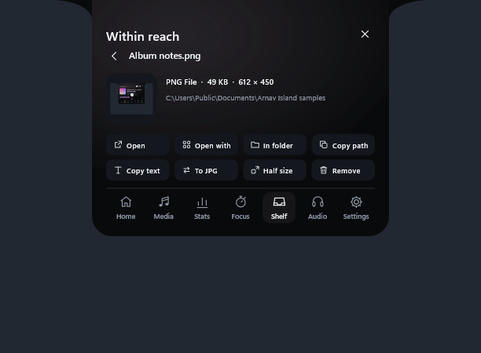
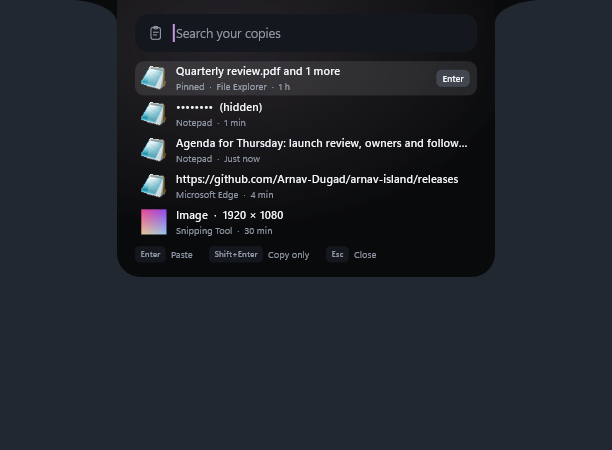

# Arnav Island 0.12 — capture and Shelf superpowers

A native Windows 11 island with physical spring motion, real system information and no cloud.

[Download the Windows x64 preview](https://github.com/Arnav-Dugad/arnav-island/releases/tag/v0.12.0-preview.1)

- **Snip, copy text, pick a colour**: Alt+Shift+S, Alt+Shift+T and Alt+Shift+C freeze the screen (without the island) for a region, a window or a pixel. Snips land on the Shelf and the clipboard; text is read on your PC by Windows' own recognition; colours copy as HEX or RGB.
- **Shelf quick actions**: open, open with, show in folder, copy path, copy text from images, convert to PNG or JPG, half size, and ZIP a file, folder or the whole Shelf.
- **Clipboard v2**: search your copies, pin favourites (saved encrypted), paste from the Alt+Shift+V picker, and passwords stay hidden until you point at them.
- **Keep the Shelf** across restarts (opt-in; links only, never copies).
- Carried forward: synced lyrics, artwork colours, smart seeking, headphone card, per-app volume, glass materials, Animation Lab, waveform timeline, command bar, workspaces, privacy dots, edge reveal, device and battery cards, mixer, focus timer and 180 brand marks.

No account, subscription, browser engine, driver or administrator access is required. Extract the ZIP and run ArnavIsland.exe. The only feature that goes online is synced lyrics, and it is off until you turn it on.

[Release notes](docs/RELEASE_NOTES.md) · [Quick start](docs/QUICK_START.md) · [Report](docs/REPORT.md) · [Feature limits](docs/FEATURE_MATRIX.md) · [Delivery phases](docs/DELIVERY_PHASES.md) · [Design system](docs/DESIGN_SYSTEM.md) · [Performance](docs/PERFORMANCE_RESULTS.md) · [Privacy](docs/PRIVACY.md)

## Build

MinGW-w64 GCC 16 and CMake: `scripts/build.ps1 -Test` builds the app and runs the unit suites; `scripts/package.ps1` makes the release ZIP. Backend: Win32, DirectComposition, Direct2D/DirectWrite, Windows.UI.Composition for glass, Windows.Media.Ocr for text recognition, WIC for images and WinHTTP for the optional lyrics lookup. Unavailable values are shown as unavailable, never invented.

