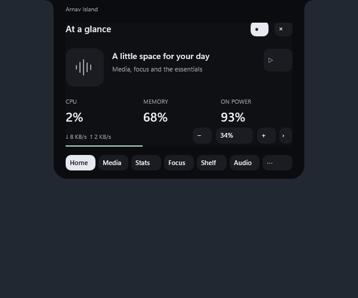

# Arnav Island v0.3.0-preview.1

A smaller native Windows 11 island, connected to the top edge with curved shoulders. Hover to open; pin to keep it open. Right-edge docking is optional.

[Download the Windows x64 preview](https://github.com/Arnav-Dugad/arnav-island/releases/latest). Extract the ZIP and run ArnavIsland.exe. No account, subscription, browser engine, cloud or administrator access is required. The binary is unsigned.

- Seven views: Home, Media, Stats, Focus, Shelf, Audio and Preferences.
- A 196 × 34 logical-pixel compact body; 420 × 300 expanded panel, configurable scale, width, corners, placement and theme.
- Retargetable compositor springs, persistent artwork glide, restrained charging response, magnetic button highlights, compact media/timer/volume activities.
- Native acrylic within the expanded panel, with opaque fallback. The outer silhouette stays solid.
- Copy-only file and text shelf. Drag an item back out. Scroll through up to 32 entries; clearing removes references, not originals.
- Live Windows media metadata/artwork, volume, output selection, CPU/RAM/network/disk statistics, battery and focus timers.
- Five preference groups, automatic local save, sign-in startup toggle and Animation Lab.

Source is in the private development repository; the separate public repository distributes the app. This remains a preview. See [feature limits](docs/FEATURE_MATRIX.md), [validation report](docs/REPORT.md), [privacy](docs/PRIVACY.md) and [measured performance](docs/PERFORMANCE_RESULTS.md).

Build using CMake and a C++23 Windows toolchain, or run `scripts/build.ps1 -Test`. Development uses installed MinGW-w64/GCC and DirectComposition rather than adding a Windows App SDK runtime. No source was copied from UsageNotch; its UI was studied as a design reference.
