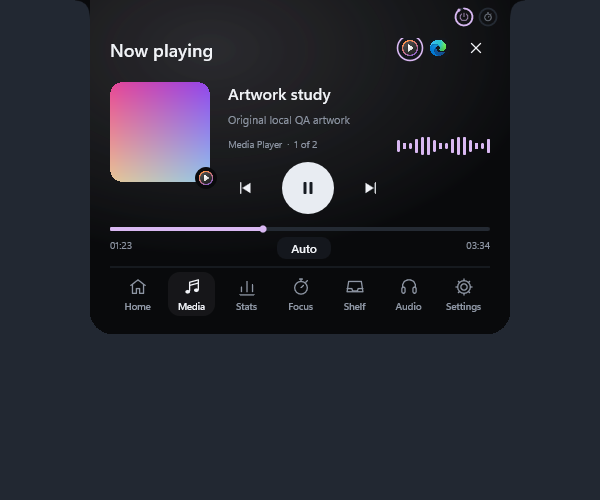
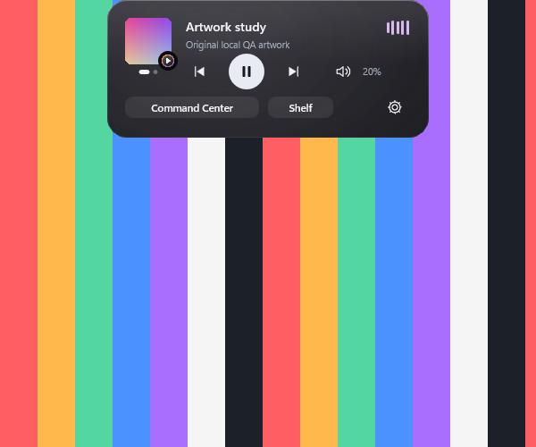

# Arnav Island 0.7 — glass, sound and a real Settings window

A native Windows 11 island with physical spring motion, real system information and no cloud.

[Download the Windows x64 preview](https://github.com/Arnav-Dugad/arnav-island/releases/tag/v0.7.0-preview.1)

- **Glass material** — Frosted or Clear glass that genuinely blurs what is behind the island and morphs with it at display refresh rate. Solid remains available.
- **Settings window** — every preference in one place, applied live as you drag or toggle. Saved automatically.
- **Every media session** — swipe between simultaneous players; real app logos from Windows; YouTube/YouTube Music identified only when confirmed.
- **Live waveform** — bars driven by the real system audio (WASAPI loopback + FFT), resting in silence.
- **Per-app mixer** — volume, mute and live meters for each application.
- **Volume and brightness indicator** — the resting island grows into a level bar.
- Carried forward: Mini Pill / Live Island / Command Center, hover-only opening (now intent-aware), precision seeking, file shelf with previews, focus timer, glance rings, statistics, output switching, display memory.

No account, subscription, browser engine, cloud, driver or administrator access is required. Extract the ZIP and run ArnavIsland.exe.

[Release notes](docs/RELEASE_NOTES.md) · [Quick start](docs/QUICK_START.md) · [Report](docs/REPORT.md) · [Feature limits](docs/FEATURE_MATRIX.md) · [Delivery phases](docs/DELIVERY_PHASES.md) · [Design system](docs/DESIGN_SYSTEM.md) · [Performance](docs/PERFORMANCE_RESULTS.md) · [Privacy](docs/PRIVACY.md)

Build with MinGW-w64 GCC 16 and CMake (`scripts/build.ps1 -Test`). Backend: Win32, DirectComposition, Direct2D/DirectWrite, plus Windows.UI.Composition for the glass backdrop. Unavailable values are shown as unavailable, never invented.

