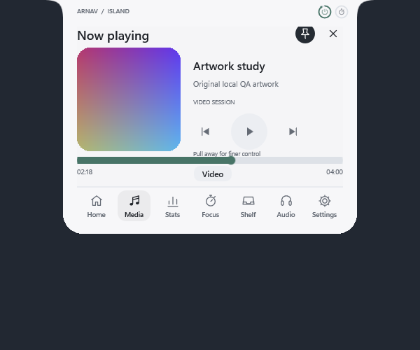
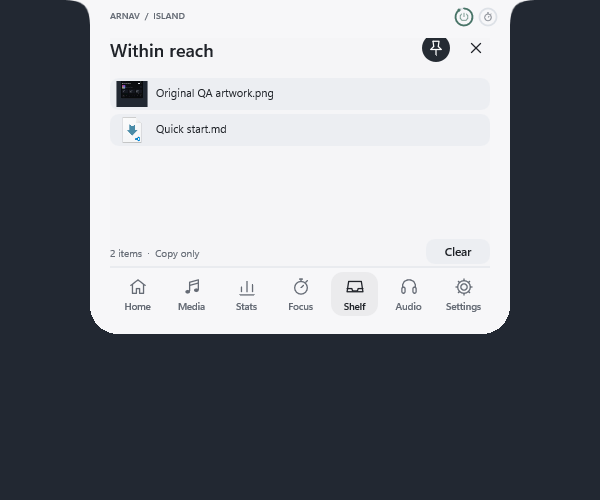
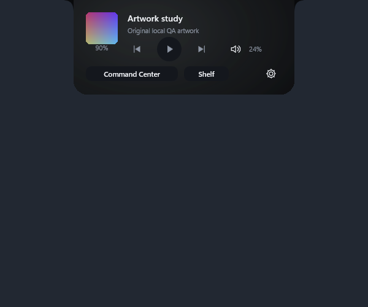
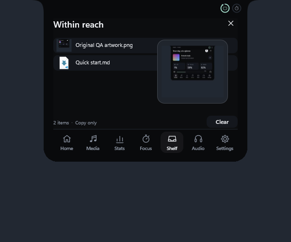
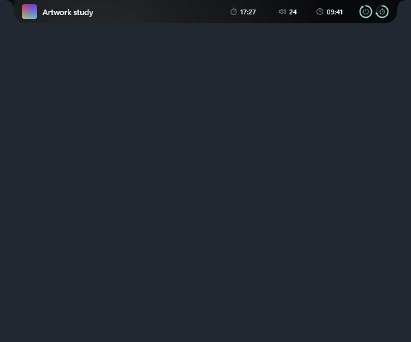

# Arnav Island

A native Windows 11 island with original vector icons, restrained information design and responsive physical motion.

[Download v0.6.0-preview.1 for Windows x64](https://github.com/Arnav-Dugad/arnav-island/releases/tag/v0.6.0-preview.1)

## A new visual system

- Sharp vector navigation, media, audio, file and system icons with physical hover/press feedback.
- Aligned statistic cards, centered controls and a labelled navigation bar.
- Track handoff that blends outgoing and incoming covers, including interrupted changes.
- Personal layouts: reorder all seven navigation items and choose three Home statistics.
- Battery and timer glance rings with animated markers.
- App-switch collapse that preserves your page and timer, pinned panels, improved fullscreen detection and safer slider-only volume scrolling.
- A real draggable volume slider, local system information, media controls, timers, audio outputs and copy-only file shelf.

Extract the ZIP and run ArnavIsland.exe. No account, subscription, cloud, browser engine, driver or administrator access is required. Existing settings and sign-in startup controls remain local.

[Quick start](QUICK_START.md) · [Release notes](RELEASE_NOTES.md) · [Design system](DESIGN_SYSTEM.md) · [Future ideas](FUTURE_IDEAS.md)

The artwork study is explicitly labelled synthetic local QA artwork. Real thumbnails depend on what Windows receives from the player. Audio default switching uses an optional isolated compatibility interface. Shelf entries are in-memory references/text, copy-only, with Shell thumbnails or file icons.

This is an unsigned preview. Full accessibility, mixed-DPI/high-refresh validation, GPU device-loss recovery and long-duration reliability remain unfinished. Sparse native motion captures and passing tests are not a universal frame-pacing or production-scale guarantee.

This public repository distributes releases and user documentation. Development source remains private.

## v0.5 refinements

Maximized browsers stay visible beneath the island. The new timeline supports precision seeking, shelf entries gain asynchronous Windows previews and native drag imagery, and audio handoff feedback waits for a confirmed output change.

Document previews depend on Windows thumbnail handlers; unsupported files use icons. Seeking depends on the player's Windows media capabilities. Physical device changes, external drag sessions and fullscreen entry/exit still need broader acceptance testing.

## Everyday scale — v0.6

Choose Mini Pill, Live Island or Command Center. The daily hover card is smaller, compact width reaches 560 DIPs, and blank-space clicks no longer expand or pin the island. No product name is drawn on the surface. Compact content is configurable; Shelf peek and per-display placement memory are included. Artwork light blends through retained compositor springs.

This is phase one. [Delivery phases and API research](DELIVERY_PHASES.md) distinguish the remaining audio, device, privacy and productivity integrations from shipped features. Actual high-refresh FPS and physical mixed-DPI docking remain unmeasured. The ZIP is an unsigned Windows 11 x64 preview.
