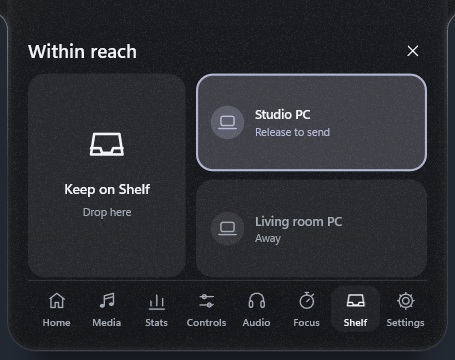
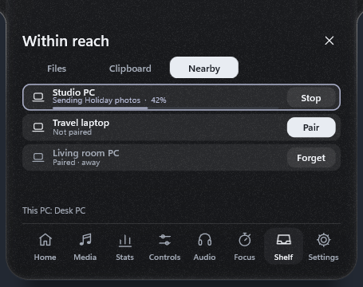
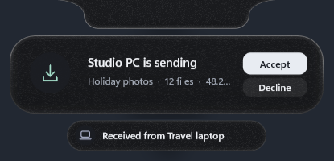

# Arnav Island 0.16 — music from the island, sharing that goes where you drop it

A native Windows 11 island with physical spring motion, real system information and no cloud.

[Download the Windows x64 preview](https://github.com/Arnav-Dugad/arnav-island/releases/tag/v0.16.0-preview.2)

- **Share by dropping**: drag files or folders over the island and let go on your other PC. Folders keep their tree, the whole Shelf goes in one transfer, and a row fills as it goes, with Stop on both PCs.
- **Music from the island**: your Music folder in Media › Library, played by the island itself, with the keyboard's media keys. Hand what's playing to your other PC and it carries on from there.
- **Two alerts at once**: a second alert buds off the first pill and takes its place in turn.
- **Drag to skip** anywhere the music shows, with a chip that snaps when letting go would skip.
- **The clipboard remembers** after a restart, encrypted for your Windows account.
- **Motion and sound**: a liquid navigation pill, Island DJ's halo in the next song's colours, a faint chime with alerts and soft clicks in the chips editor.
- **Weather works again** (Open-Meteo's compressed answers are now read).
- Carried forward: the drop pill, weather with an animated sky, the Controls page, sharing between your PCs, compact media controls, the spectrum ring, word-timed lyrics, the glass material, the screen-capture dot, live GPU, rolling digits, file search, system switches, currency, synced lyrics, capture tools, Shelf actions, the clipboard with pins, per-app volume, workspaces and more.

No account, subscription, browser engine, driver or administrator access is required. Extract the ZIP and run ArnavIsland.exe. Only a few features go online, and all are off until you turn them on: synced lyrics, currency conversion, weather and site icons. Sharing and handing music over talk only to your own PCs on your network; the music library reads your Music folder on this PC only.

[Release notes](docs/RELEASE_NOTES.md) · [Quick start](docs/QUICK_START.md) · [Report](docs/REPORT.md) · [Feature limits](docs/FEATURE_MATRIX.md) · [Delivery phases](docs/DELIVERY_PHASES.md) · [Design system](docs/DESIGN_SYSTEM.md) · [Performance](docs/PERFORMANCE_RESULTS.md) · [Privacy](docs/PRIVACY.md)

## Build

MinGW-w64 GCC 16 and CMake: `scripts/build.ps1 -Test` builds the app and runs the unit suites; `scripts/package.ps1` makes the release ZIP. Backend: Win32, DirectComposition, Direct2D/DirectWrite, Windows.UI.Composition for glass, Windows.Media.Ocr for text recognition, WIC for images, the Windows Search index (OLE DB) for files, Windows.Devices.Radios for Bluetooth and Wi-Fi, PDH performance counters for the GPU, WinHTTP for the optional lyrics, exchange rates, weather and site icons, Winsock with Windows CNG (ECDH P-256, AES-GCM) and DPAPI for sharing between your PCs, and Media Foundation with Windows media transport controls for the island's own player. Unavailable values are shown as unavailable, never invented.

