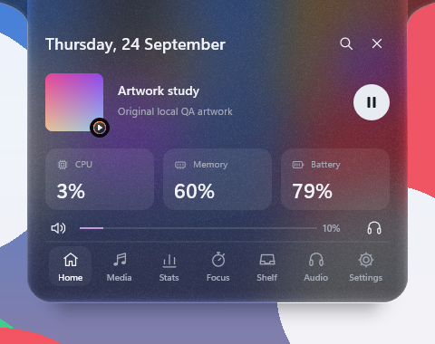
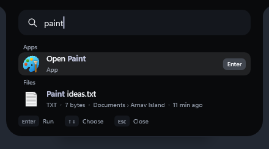

# Arnav Island 0.14 — new glass, a screen-capture dot, live GPU, a left dock

A native Windows 11 island with physical spring motion, real system information and no cloud.

[Download the Windows x64 preview](https://github.com/Arnav-Dugad/arnav-island/releases/tag/v0.14.0-preview.1)

- **Glass, rebuilt**:
  - a real material with vibrancy and a calm luminosity band
  - light gathered along the edges and a highlight that tilts as the island moves
  - fine grain and a soft shadow, tinted to your wallpaper
- **Awareness**: a purple dot when an app is capturing your screen, and live GPU use on the Stats page, on Home and in the compact island.
- **An idle glance**: with nothing else to show, the compact island shows the date, CPU and GPU.
- **Motion**:
  - volume, battery, timers and statistics roll digit by digit
  - compact lyrics morph from line to line
  - the artwork pulses to the beat
  - the shape flows like liquid
- **Command bar**: Space types a space again, results are grouped under small headers, colour codes show a swatch, and misspellings get a "Did you mean…?".
- **Dock on the left**, as well as the top and right.
- Carried forward: file search, system switches, currency conversion, synced lyrics, snip, copy text from the screen, colour picker, Shelf actions, clipboard with pins, artwork colours, smart seeking, per-app volume, Animation Lab, workspaces, privacy dots, edge reveal, device and battery cards, mixer, focus timer and 180 brand marks.

No account, subscription, browser engine, driver or administrator access is required. Extract the ZIP and run ArnavIsland.exe. Only two features go online, and both are off until you turn them on: synced lyrics and currency conversion.

[Release notes](docs/RELEASE_NOTES.md) · [Quick start](docs/QUICK_START.md) · [Report](docs/REPORT.md) · [Feature limits](docs/FEATURE_MATRIX.md) · [Delivery phases](docs/DELIVERY_PHASES.md) · [Design system](docs/DESIGN_SYSTEM.md) · [Performance](docs/PERFORMANCE_RESULTS.md) · [Privacy](docs/PRIVACY.md)

## Build

MinGW-w64 GCC 16 and CMake: `scripts/build.ps1 -Test` builds the app and runs the unit suites; `scripts/package.ps1` makes the release ZIP. Backend: Win32, DirectComposition, Direct2D/DirectWrite, Windows.UI.Composition for glass, Windows.Media.Ocr for text recognition, WIC for images, the Windows Search index (OLE DB) for files, Windows.Devices.Radios for Bluetooth and Wi-Fi, PDH performance counters for the GPU, and WinHTTP for the optional lyrics and exchange rates. Unavailable values are shown as unavailable, never invented.

