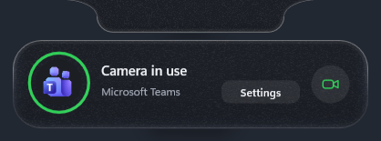
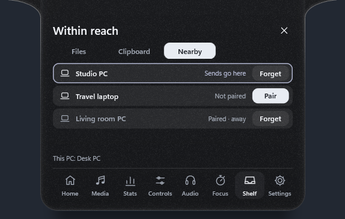
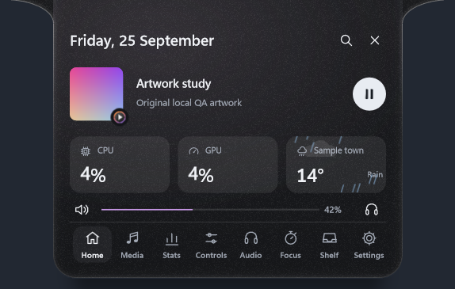

# Arnav Island 0.15 — a pill that drops, a sky that moves, your PCs within reach

A native Windows 11 island with physical spring motion, real system information and no cloud.

[Download the Windows x64 preview](https://github.com/Arnav-Dugad/arnav-island/releases/tag/v0.15.0-preview.1)

- **Notifications drop out** of the island as their own glass pill, with light running along the edge, and settle back in.
- **Now Playing**:
  - previous, play and next in the compact island
  - swipe to skip
  - the island over fullscreen apps at a touch of the screen's edge
  - a spectrum ring around the cover
  - lyrics that light up word by word
- **Weather** on Home and in the glance, with an animated sky: sun, stars, clouds, rain, snow, fog and storms.
- **A Controls page** for Wi-Fi, Bluetooth, airplane mode, dark mode, the focus timer, the microphone, volume and brightness.
- **Share files between your own PCs** on your network: pair once with a six-digit code; transfers are end-to-end encrypted and need accepting.
- **Awareness**:
  - which app is using the camera, with one click to its privacy settings
  - battery health trends with a weekly card
  - rich clipboard previews
- **Motion**:
  - numbers that blur on big jumps
  - icons that morph
  - an island that leans when you drag it
  - a shadow that deepens as it grows
  - text that adapts to your wallpaper on Clear glass
- Carried forward: the glass material, the screen-capture dot, live GPU, rolling digits, file search, system switches, currency, synced lyrics, capture tools, Shelf actions, the clipboard with pins, per-app volume, workspaces and more.

No account, subscription, browser engine, driver or administrator access is required. Extract the ZIP and run ArnavIsland.exe. Only a few features go online, and all are off until you turn them on: synced lyrics, currency conversion, weather and site icons. Sharing talks only to your own PCs on your network.

[Release notes](docs/RELEASE_NOTES.md) · [Quick start](docs/QUICK_START.md) · [Report](docs/REPORT.md) · [Feature limits](docs/FEATURE_MATRIX.md) · [Delivery phases](docs/DELIVERY_PHASES.md) · [Design system](docs/DESIGN_SYSTEM.md) · [Performance](docs/PERFORMANCE_RESULTS.md) · [Privacy](docs/PRIVACY.md)

## Build

MinGW-w64 GCC 16 and CMake: `scripts/build.ps1 -Test` builds the app and runs the unit suites; `scripts/package.ps1` makes the release ZIP. Backend: Win32, DirectComposition, Direct2D/DirectWrite, Windows.UI.Composition for glass, Windows.Media.Ocr for text recognition, WIC for images, the Windows Search index (OLE DB) for files, Windows.Devices.Radios for Bluetooth and Wi-Fi, PDH performance counters for the GPU, WinHTTP for the optional lyrics, exchange rates, weather and site icons, and Winsock with Windows CNG (ECDH P-256, AES-GCM) and DPAPI for sharing between your PCs. Unavailable values are shown as unavailable, never invented.

