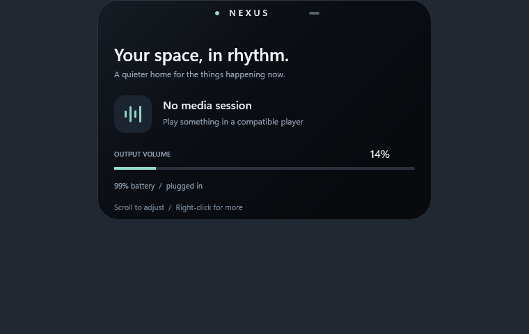

# Nexus Island

A native Windows 11 island built around continuous physical motion.



**Status: runnable engineering prototype. Milestone 1 is not yet complete.**
The compositor renderer, spring solver, real audio/battery integration, GSMTC
foundation and Animation Lab are working. See [feature status](docs/FEATURE_MATRIX.md)
for the remaining release gates and unsupported features.

## Run

Open `NexusIsland.exe` from the Desktop project folder's `app` directory.
Click the top-center pill to expand. Scroll over it to change system volume.
Drag and release to test resistance. Right-click it or the tray icon for the
Animation Lab, Settings, diagnostics or Exit. The app does not launch at login.

Developer commands:

```powershell
.\scripts\build.ps1 -Test
.\build\NexusIsland.exe --lab --expanded
.\build\NexusIsland.exe --benchmark
```

The build uses CMake and a C++23 Windows compiler. The validated toolchain is
MinGW-w64 GCC 16.2. MSVC support is intended but has not been compiled on this
machine. Install no runtime for the provided executable. No Electron, Chromium,
web surface, paid API, cloud dependency or kernel driver.

The installed compiler was enough to build a documented DirectComposition
backend. A future Windows.UI.Composition/C++/WinRT backend can reuse the tested
motion and activity models. See [architecture](docs/ARCHITECTURE.md),
[animation](docs/ANIMATION_SYSTEM.md), [performance](docs/PERFORMANCE.md),
[measured results](docs/PERFORMANCE_RESULTS.md), [privacy](docs/PRIVACY.md), and
[development report](docs/REPORT.md).
