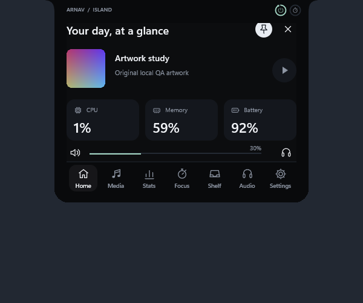

# Arnav Island 0.4 — a new visual system

A native Windows 11 island with a compact connected silhouette, original vector icons and responsive physical motion.

[Download the Windows x64 preview](https://github.com/Arnav-Dugad/arnav-island/releases/tag/v0.5.0-preview.1)

- A redesigned dashboard: clear text hierarchy, aligned statistic cards, centered controls and a labelled icon navigation bar.
- 35 original vector symbols on one optical grid. Interactive icons lift and compress through compositor springs; the selected navigation indicator travels between destinations.
- **Track handoff:** outgoing and incoming covers blend while the same artwork object glides between compact and expanded views. Interrupting a blend preserves its visible mixture.
- **Personal layouts:** reorder all seven navigation items and independently choose three Home statistics. Settings survive restart, and invalid saved orders recover safely.
- **Glance rings:** battery and timer progress with animated markers; select Battery, Timer, Both or Off.
- A real draggable volume slider, keyboard volume adjustment, media controls, focus timers, file shelf, audio outputs and local system statistics.
- Dark/light/system themes, native interior acrylic, configurable hover, startup and reduced motion.

No account, subscription, browser engine, cloud, driver or administrator access is required. Extract the ZIP and run ArnavIsland.exe. The release is unsigned and remains a preview: full accessibility, mixed-DPI/high-refresh hardware acceptance and long-duration reliability are unfinished.

The public repository distributes binaries and user documentation; source history remains private. [Report](docs/REPORT.md) · [Feature limits](docs/FEATURE_MATRIX.md) · [Design system](docs/DESIGN_SYSTEM.md) · [Performance evidence](docs/PERFORMANCE_RESULTS.md) · [Privacy](docs/PRIVACY.md).

Build with a C++23 Windows toolchain and CMake, or `scripts/build.ps1 -Test`. The current native backend is Win32/DirectComposition/Direct2D/DirectWrite. Original Windows APIs provide system information; unavailable values are not invented.

The v0.5 preview fixes maximized-browser disappearance and adds precision seeking, background shelf thumbnails, drag imagery and confirmed audio-route feedback. See [release notes](docs/RELEASE_NOTES.md).
