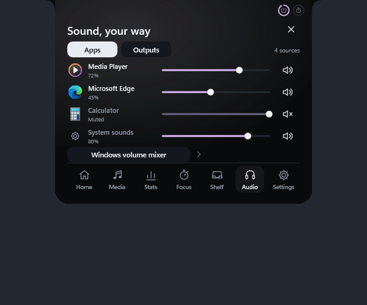
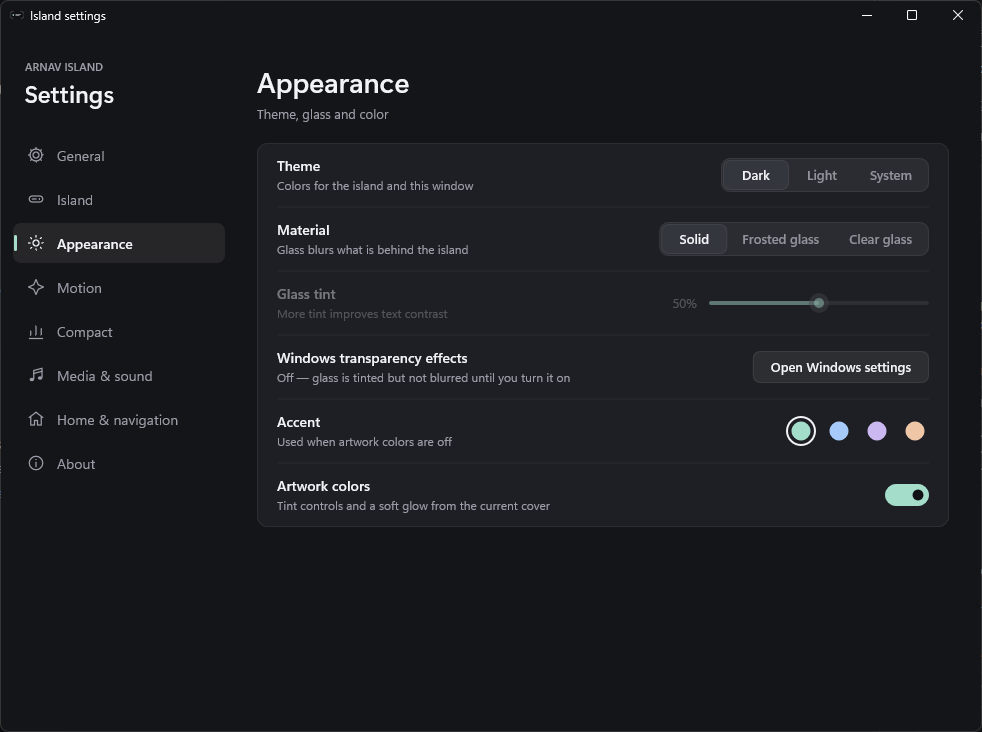

# Arnav Island

A native Windows 11 island with physical spring motion, real system information and no cloud.

[Download v0.7.0-preview.1 for Windows x64](https://github.com/Arnav-Dugad/arnav-island/releases/tag/v0.7.0-preview.1)

## v0.7 — glass, sound and a real Settings window

- **Glass material.** Frosted or Clear glass genuinely blurs what is behind the island and morphs with it at your display's refresh rate, with a soft sheen and a light-catching rim. Solid is still available. Blur needs Windows *Transparency effects* turned on.
- **Settings window.** Every preference in one window, applied to the island the moment you drag or toggle, and saved automatically.
- **Every media session.** Swipe between simultaneous players (drag, touchpad swipe or tap). The artwork shows the playing app's own logo from Windows; YouTube and YouTube Music are marked when the browser confirms them.
- **Live waveform** from the real system audio, resting when nothing plays.
- **Per-app mixer** with volume, mute and live meters for each application.
- **Volume and brightness indicator** — the resting island grows into a level bar.
- Hover opening now ignores a pointer that is only passing by.

Extract the ZIP and run ArnavIsland.exe. No account, subscription, cloud, browser engine, driver or administrator access is required. Preferences and sign-in startup stay local to your Windows account.

[Quick start](QUICK_START.md) · [Release notes](RELEASE_NOTES.md) · [Design system](DESIGN_SYSTEM.md) · [Delivery phases](DELIVERY_PHASES.md) · [Future ideas](FUTURE_IDEAS.md)

Screenshots use synthetic sessions built from stock Windows app icons. Real logos, artwork and controls depend on what each player publishes to Windows. Loopback analysis never records audio; protected playback may appear silent.

This is an unsigned preview. Screen-reader support for the custom controls, measured 120–240 Hz presentation, GPU/power use and long-run stability remain unverified.

This public repository distributes releases and user documentation. Development source remains private.

## Earlier releases

v0.6 introduced Mini Pill, Live Island and Command Center, 560-DIP compact width, shelf peek and display memory. v0.5 added precision seeking, shelf previews and audio handoff. v0.4 introduced the vector icon system and personal layouts.

