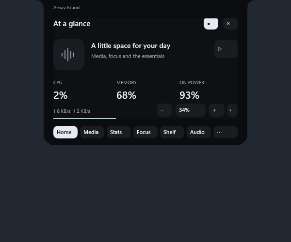
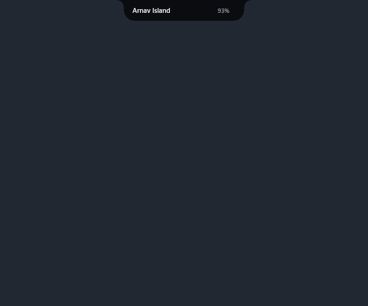

# Arnav Island

A small, local Windows 11 island with smooth native motion and a curved connection to the display edge.

[Download v0.3.0-preview.1 for Windows x64](https://github.com/Arnav-Dugad/arnav-island/releases/tag/v0.3.0-preview.1)

Hover to open. Browse Media, Stats, Focus, Shelf, Audio and Preferences. Hold files or text temporarily, switch audio outputs, keep track of timers, and customize the shape, theme, motion and startup behavior.

Extract the ZIP and launch ArnavIsland.exe. No account, cloud, subscription, browser engine, driver or administrator access is required. This is an unsigned preview.

- Small top-center dock; optional right-edge placement.
- Persistent artwork glide, compact activities, physical hover feedback and charging pulse.
- Native acrylic inside expanded panels with opaque fallback.
- Five preference groups, sign-in startup toggle, dark/light/system themes and configurable hover.
- Real Windows media, battery, CPU/RAM/network statistics and output devices.

[Quick start](QUICK_START.md) · [Release notes and limitations](RELEASE_NOTES.md) · [Future ideas](FUTURE_IDEAS.md)

Media artwork depends on what Windows receives from the player. Direct audio switching is an optional compatibility interface. File shelf entries are in-memory references and text, copy-only; file-content previews are not included. Full accessibility, mixed-DPI/high-refresh validation and long-duration reliability remain unfinished. No complete feature or performance guarantee is made.

This public repository hosts releases and user documentation. The development repository remains private.
