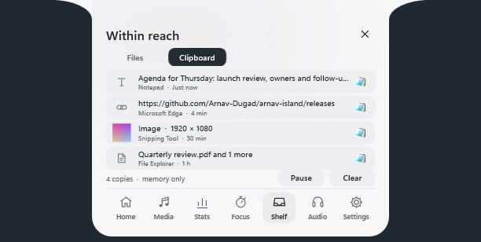
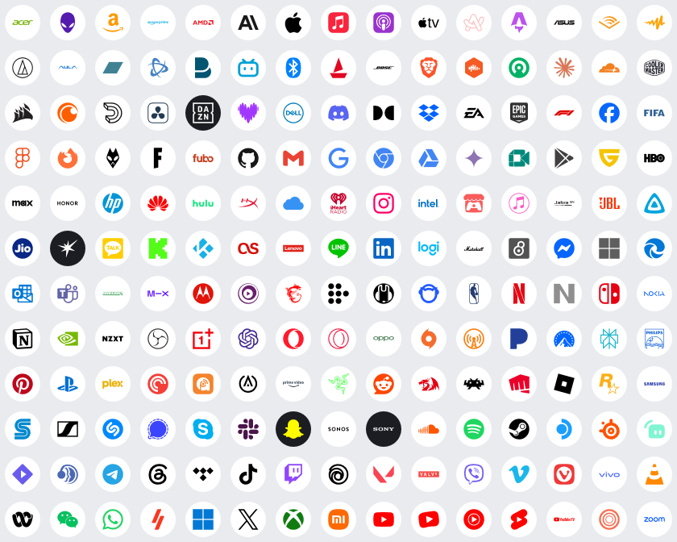

# Arnav Island

A native Windows 11 island with physical spring motion, real system information and no cloud.

[Download v0.9.0-preview.1 for Windows x64](https://github.com/Arnav-Dugad/arnav-island/releases/tag/v0.9.0-preview.1)

## v0.9 — type it, copy it, see who's listening

- **Command bar.** Press Alt+Shift+Space and type: "volume 30", "focus 25", "open edge", "find budget pdfs from last month", "bluetooth settings", "lock". The island shows what Enter will do before anything happens, and nothing you type ever runs as a shell command.
- **Workspaces.** "save workspace study" remembers the apps you have open; typing "study" later reopens the ones that aren't running, after a second Enter. Nothing is closed.
- **Clipboard history** (off until you turn it on). Your last 24 copies (text, links, images and files) on the Shelf, in memory only. Copies marked private and anything from password managers are skipped.
- **Privacy dots.** Green when an app uses the camera, orange for the microphone, blue for location, with the app's name when you open the island.
- **Fixed:** two browser tabs no longer show up as the same media session, and touching the screen edge now shows the compact island only.
- **Sharper and smoother.** Wider shoulder curves drawn at exact pixel size, antialiased corners, crisper text, content that eases in, and 180 real brand marks including Xbox, AULA, Philips, PowerA, Logitech and JioHotstar.

Extract the ZIP and run ArnavIsland.exe. No account, subscription, cloud, browser engine, driver or administrator access is required. Preferences, workspaces and charge history stay on your PC.

[Quick start](QUICK_START.md) · [Release notes](RELEASE_NOTES.md) · [Design system](DESIGN_SYSTEM.md) · [Delivery phases](DELIVERY_PHASES.md) · [Future ideas](FUTURE_IDEAS.md)

Screenshots use illustrative clipboard, privacy and device content. Brand marks come from Simple Icons (CC0) and public-domain files, and are trademarks of their owners, shown only to identify an app, service or device maker.

This is an unsigned preview. Screen-reader support for the custom controls, measured 120–240 Hz presentation, GPU/power use and long-run stability remain unverified.

This public repository distributes releases and user documentation. Development source remains private.

## Earlier releases

v0.8 added edge reveal, Bluetooth device and charging cards, the battery tab and ROG integration. v0.7 added the glass material, the separate Settings window, multi-session media, the live waveform and the per-app mixer. v0.6 introduced Mini Pill, Live Island and Command Center.

