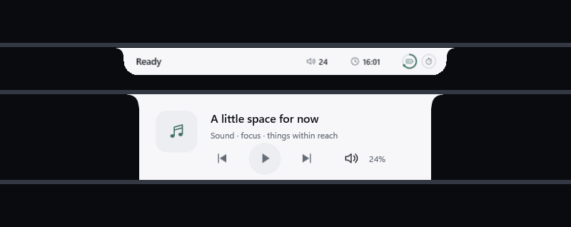
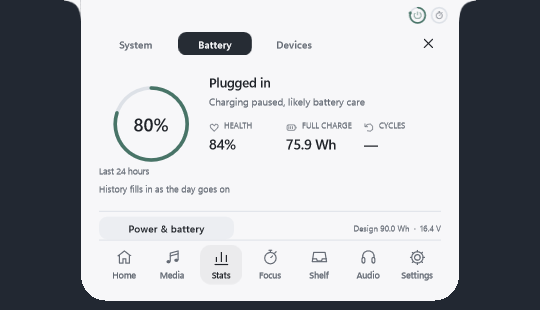

# Arnav Island

A native Windows 11 island with physical spring motion, real system information and no cloud.

[Download v0.8.0-preview.1 for Windows x64](https://github.com/Arnav-Dugad/arnav-island/releases/tag/v0.8.0-preview.1)

## v0.8 — hidden until you reach for it

- **Edge reveal.** The island stays tucked away until your pointer touches the screen edge where it lives, then slides in on a spring. Clicks pass through while it is hidden. On by default; turn it off in Settings → General.
- **Real logos.** 88 vector brand marks. Web services such as YouTube, Spotify, Netflix, Twitch, JioSaavn and Prime Video are identified only when the browser's window title confirms them; otherwise you see the browser's icon.
- **Bluetooth device cards.** Earbuds, headphones, controllers and keyboards announce themselves with the maker's logo, device type and battery. Stats → Devices lists every paired device, with one-tap connect for audio devices.
- **Battery and charging.** A charging card with a one-shot energy sweep, battery health, a 24-hour graph, labelled time estimates and the current power mode. Charge history stays on your PC.
- **ROG aware.** Shows your laptop model and opens Armoury Crate when it is installed. Read-only: nothing is sent to firmware.
- **New motion.** Cards morph out of the island, logos pop in, stats tabs glide, and pages slide in the direction you navigate.

Extract the ZIP and run ArnavIsland.exe. No account, subscription, cloud, browser engine, driver or administrator access is required. Preferences, charge history and sign-in startup stay local to your Windows account.

[Quick start](QUICK_START.md) · [Release notes](RELEASE_NOTES.md) · [Design system](DESIGN_SYSTEM.md) · [Delivery phases](DELIVERY_PHASES.md) · [Future ideas](FUTURE_IDEAS.md)

Device screenshots use illustrative sample devices. Device battery appears only for devices that report it to Windows, and Windows offers no public API for the Bluetooth codec. Brand marks come from Simple Icons (CC0) and are trademarks of their owners, shown only to identify an app, service or device maker.

This is an unsigned preview. Screen-reader support for the custom controls, measured 120–240 Hz presentation, GPU/power use and long-run stability remain unverified.

This public repository distributes releases and user documentation. Development source remains private.

## Earlier releases

v0.7 added the glass material, the separate Settings window, multi-session media, the live waveform, the per-app mixer and the volume and brightness indicator. v0.6 introduced Mini Pill, Live Island and Command Center, 560-DIP compact width, shelf peek and display memory. v0.5 added precision seeking, shelf previews and audio handoff. v0.4 introduced the vector icon system and personal layouts.

