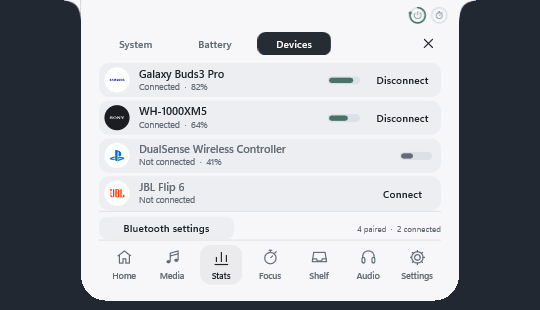

# Arnav Island 0.8 — hidden until you reach for it

A native Windows 11 island with physical spring motion, real system information and no cloud.

[Download the Windows x64 preview](https://github.com/Arnav-Dugad/arnav-island/releases/tag/v0.8.0-preview.1)

- **Edge reveal**: the island stays tucked away until your pointer touches the screen edge where it lives, then slides in on a spring. Clicks pass through while it is hidden.
- **Real logos**: 88 vector brand marks. Web services such as YouTube, Spotify, Netflix, Twitch and JioSaavn are identified only when the browser's window title confirms them.
- **Bluetooth device cards**: maker logo, device type and battery when a device connects or disconnects, plus a Devices tab with one-tap connect for audio devices.
- **Battery and charging**: charging card with a one-shot energy sweep, battery health, 24-hour graph, time estimates and power mode.
- **ROG aware**: shows the laptop model and opens Armoury Crate when it is installed. Read-only; no firmware access.
- Carried forward: glass material, live Settings window, multi-session media, live waveform, per-app mixer, volume and brightness indicator, hover-only opening, precision seeking, file shelf, focus timer, display memory.

No account, subscription, browser engine, cloud, driver or administrator access is required. Extract the ZIP and run ArnavIsland.exe.

[Release notes](docs/RELEASE_NOTES.md) · [Quick start](docs/QUICK_START.md) · [Report](docs/REPORT.md) · [Feature limits](docs/FEATURE_MATRIX.md) · [Delivery phases](docs/DELIVERY_PHASES.md) · [Design system](docs/DESIGN_SYSTEM.md) · [Performance](docs/PERFORMANCE_RESULTS.md) · [Privacy](docs/PRIVACY.md)

Build with MinGW-w64 GCC 16 and CMake (`scripts/build.ps1 -Test`). Backend: Win32, DirectComposition, Direct2D/DirectWrite, plus Windows.UI.Composition for the glass backdrop. Unavailable values are shown as unavailable, never invented.

