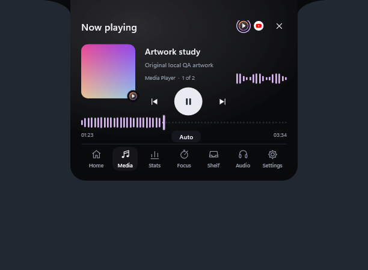
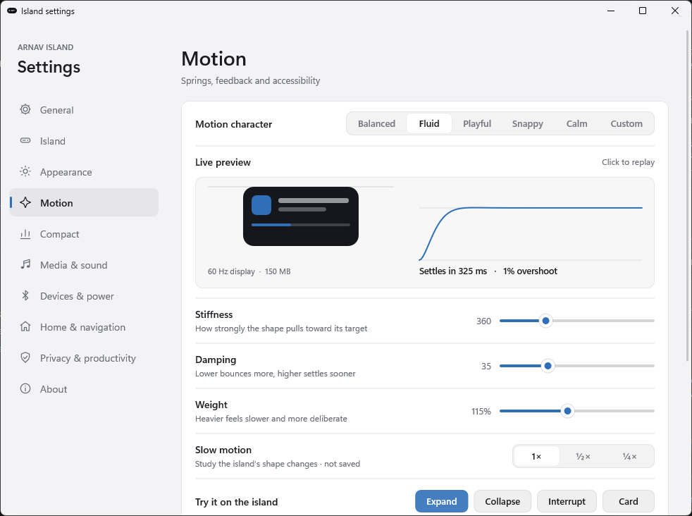
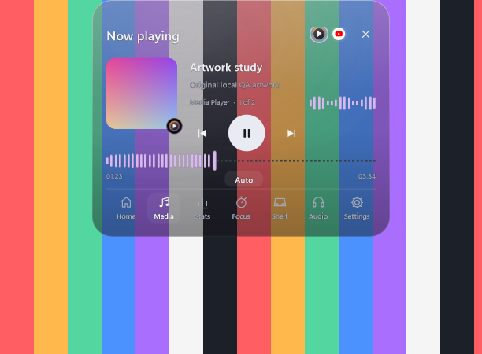

# Arnav Island 0.10 — glass, a lab and a waveform

A native Windows 11 island with physical spring motion, real system information and no cloud.

[Download the Windows x64 preview](https://github.com/Arnav-Dugad/arnav-island/releases/tag/v0.10.0-preview.1)

- **Waveform timeline**: the Media page's timeline is the track's own loudness, learned from the audio actually playing. Unheard stretches stay as dots until they play.
- **Frosted and Clear glass that differ**: Frosted blurs (or frosts, when Windows transparency is off); Clear never blurs and lets the desktop through. A soft light follows your pointer.
- **Animation Lab in Settings → Motion**: a live preview with the spring's curve, settle time and overshoot; Custom stiffness, damping and weight; slow motion; and buttons that play real transitions on the island and report the frames Windows composed.
- **Motion**: liquid shape morph, rows that cascade in, icons that pop when they change.
- **Wallpaper accent**: a fifth accent colour taken from your desktop wallpaper.
- Carried forward: command bar, workspaces, clipboard history, privacy dots, edge reveal, Bluetooth and battery cards, multi-session media, live waveform, per-app mixer, focus timer, file shelf and 180 brand marks.

No account, subscription, browser engine, cloud, driver or administrator access is required. Extract the ZIP and run ArnavIsland.exe.

[Release notes](docs/RELEASE_NOTES.md) · [Quick start](docs/QUICK_START.md) · [Report](docs/REPORT.md) · [Feature limits](docs/FEATURE_MATRIX.md) · [Delivery phases](docs/DELIVERY_PHASES.md) · [Design system](docs/DESIGN_SYSTEM.md) · [Performance](docs/PERFORMANCE_RESULTS.md) · [Privacy](docs/PRIVACY.md)

## Build

MinGW-w64 GCC 16 and CMake: `scripts/build.ps1 -Test` builds the app and runs the unit suites; `scripts/package.ps1` makes the release ZIP. Backend: Win32, DirectComposition, Direct2D/DirectWrite, plus Windows.UI.Composition for the glass backdrop. Unavailable values are shown as unavailable, never invented.

