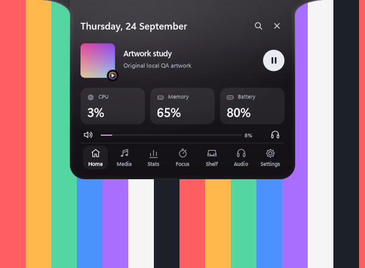
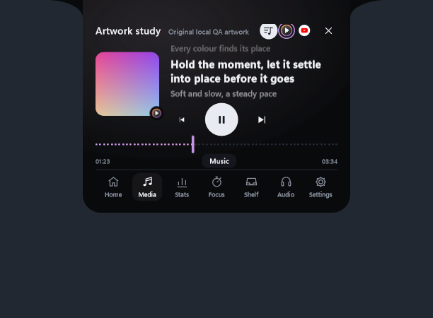
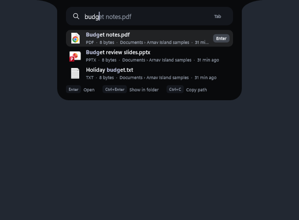

# Arnav Island 0.13 — command bar v2, glass that meets the screen, new lyrics

A native Windows 11 island with physical spring motion, real system information and no cloud.

[Download the Windows x64 preview](https://github.com/Arnav-Dugad/arnav-island/releases/tag/v0.13.0-preview.1)

- **Glass in the island's own shape**: Frosted and Clear glass meet the top of the screen with concave shoulders, like Solid. Frosted adds vibrancy to Windows' blur, and a specular rim and inner glow trace the whole outline.
- **Lyrics, redesigned**: the sung line springs into place, and a fill sweeps across it with the song. Instrumental breaks show three dots, and you can tap any line to jump there.
- **Command bar v2**:
  - your files from the Windows Search index as you type
  - system switches that know their state: dark mode, Bluetooth, Wi-Fi, airplane mode, recycle bin, sleep, restart
  - pinned, suggested and recent commands
  - highlighted matches and Tab completion
  - optional currency conversion with rolling digits
- Carried forward: snip, copy text from the screen, colour picker, Shelf actions, clipboard with pins, synced lyrics, artwork colours, smart seeking, per-app volume, glass materials, Animation Lab, command bar, workspaces, privacy dots, edge reveal, device and battery cards, mixer, focus timer and 180 brand marks.

No account, subscription, browser engine, driver or administrator access is required. Extract the ZIP and run ArnavIsland.exe. Only two features go online, and both are off until you turn them on: synced lyrics and currency conversion.

[Release notes](docs/RELEASE_NOTES.md) · [Quick start](docs/QUICK_START.md) · [Report](docs/REPORT.md) · [Feature limits](docs/FEATURE_MATRIX.md) · [Delivery phases](docs/DELIVERY_PHASES.md) · [Design system](docs/DESIGN_SYSTEM.md) · [Performance](docs/PERFORMANCE_RESULTS.md) · [Privacy](docs/PRIVACY.md)

## Build

MinGW-w64 GCC 16 and CMake: `scripts/build.ps1 -Test` builds the app and runs the unit suites; `scripts/package.ps1` makes the release ZIP. Backend: Win32, DirectComposition, Direct2D/DirectWrite, Windows.UI.Composition for glass, Windows.Media.Ocr for text recognition, WIC for images, the Windows Search index (OLE DB) for files, Windows.Devices.Radios for Bluetooth and Wi-Fi, and WinHTTP for the optional lyrics and exchange rates. Unavailable values are shown as unavailable, never invented.

